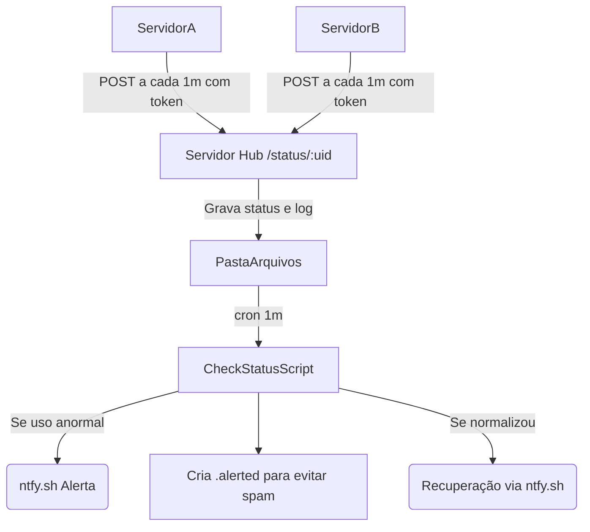

# Dead Man's Switch para Monitoramento de CPU, Memória e Disco

Este projeto expande o conceito de Dead Man's Switch para também monitorar **uso de CPU, Memória e Disco** dos servidores, de forma **simples e eficiente**.

Cada servidor envia relatórios periódicos para um servidor hub, que verifica os limites de uso e dispara alertas caso algo esteja anormal.

Agora com:
- ✅ Autenticação leve via token
- ✅ Logs históricos por dia
- ✅ Envio de alerta de recuperação quando o servidor normaliza

---

## Como Funciona

1. **Servidor Monitorado**:
    - Coleta uso de CPU, Memória e Disco usando um script Bash.
    - Envia um `POST` para o hub a cada minuto com um token de autenticação.

2. **Servidor Hub**:
    - Recebe e armazena o relatório atual em um `.json`.
    - Também grava um log histórico em `/logs/{data}/`.

3. **Script de Verificação**:
    - A cada minuto, lê os relatórios.
    - Se algum valor ultrapassar os limites, envia alerta via [ntfy.sh](https://ntfy.sh/).
    - Se o servidor voltar ao normal, envia um alerta de "recuperação".
    - Usa um arquivo `.alerted` para evitar múltiplos alertas repetidos.


---

## Scripts

### 1. Endpoint de Recebimento (`status.mjs`)

- Valida token de autenticação.
- Grava status atual.
- Grava log histórico.

### 2. Script de Verificação (`checkStatus.mjs`)

- Verifica limites de CPU, Memória e Disco.
- Envia alerta se limite for excedido.
- Envia alerta de recuperação se o servidor normalizar.
- Usa arquivo `.alerted` para controlar alertas repetidos.

### 3. Script de Coleta (Servidor Monitorado - Bash)

```bash
#!/bin/bash

CPU=$(top -bn1 | grep "Cpu(s)" | awk '{print 100 - $8}')
MEMORY=$(free | grep Mem | awk '{print ($3/$2)*100}')
DISK=$(df / | tail -1 | awk '{print $5}' | tr -d '%')

curl -X POST https://seu-hub.com/status/telerison__nome_do_servidor \
  -H "Authorization: Bearer seu_token_secreto" \
  -H "Content-Type: application/json" \
  -d "{\"cpu\":$CPU,\"memory\":$MEMORY,\"disk\":$DISK}" &>/dev/null
```

**Agendar no cron:**

```cron
* * * * * /caminho/para/script_de_coleta.sh
```


---

## Variáveis de Ambiente (.env)

```bash
PORT=8000
DOWNLOADS_PATH=/caminho/para/salvar/status
CPU_LIMIT=85
MEMORY_LIMIT=90
DISK_LIMIT=80
AUTH_TOKEN=seu_token_secreto
```


---

## Comandos CRON

**Nos servidores monitorados:**

```cron
* * * * * /caminho/para/script_de_coleta.sh
```

**No servidor hub (para checar status):**

```cron
* * * * * cd /caminho/para/app && env $(cat .env | xargs) /caminho/do/node src/scripts/checkStatus.mjs &>/dev/null
```


---

## Fluxo Resumido




---

## Melhorias Futuras

- Monitorar Load Average.
- Adicionar monitoramento de temperatura.
- Monitorar número de processos ou conexões.
- Dashboard para visualização de históricos.
- Redundância no hub de recebimento.
- Retry automático em caso de falha de envio.


---

**Feito com ❤️ para monitorar a saúde dos servidores de forma minimalista, segura e eficiente.** 🚀

