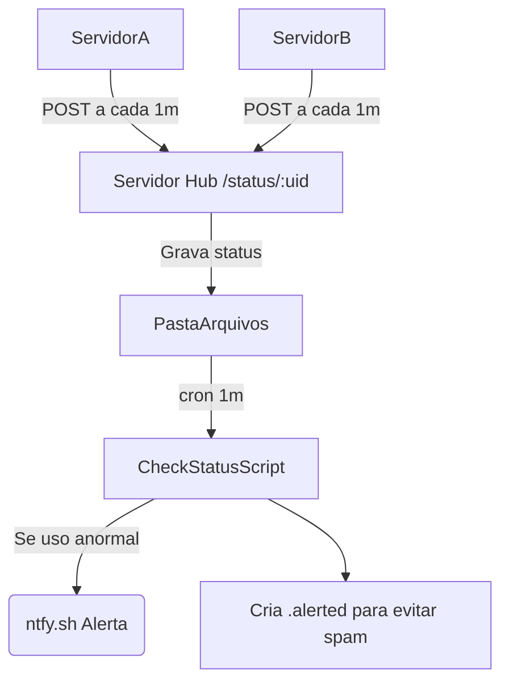

# Dead Man's Switch para Monitoramento de CPU, Memória e Disco

Este projeto expande o conceito de Dead Man's Switch para também monitorar **uso de CPU, Memória e Disco** dos servidores, de forma **simples e eficiente**.

Cada servidor envia relatórios periódicos para um servidor hub, que verifica os limites de uso e dispara alertas caso algo esteja anormal.

---

## Como Funciona

1. **Servidor Monitorado**:
    - Coleta uso de CPU, Memória e Disco usando um script Bash.
    - Envia um `POST` para o hub a cada minuto.

2. **Servidor Hub**:
    - Recebe e armazena os relatórios em arquivos `.json`.

3. **Script de Verificação**:
    - A cada minuto, lê os relatórios.
    - Se algum valor ultrapassar os limites, envia um alerta via [ntfy.sh](https://ntfy.sh/).
    - Usa um arquivo `.alerted` para evitar múltiplos alertas repetitivos.


---

## Scripts

### 1. Endpoint de Recebimento (`status.mjs`)

```javascript
import 'dotenv/config';
import fs from 'fs';
import path from 'path';
import express from 'express';

const app = express();
const port = process.env.PORT || 8000;
const fsp = fs.promises;

app.use(express.json());

app.post('/status/:uid', async (req, res) => {
  const fileName = req.params.uid;
  const content = JSON.stringify({
    timestamp: new Date().toISOString(),
    data: req.body,
  });
  const folderPath = path.join(process.env.DOWNLOADS_PATH);

  try {
    await fsp.mkdir(folderPath, { recursive: true });
    await fsp.writeFile(path.join(folderPath, `${fileName}.json`), content);

    console.log(`Status recebido de: ${fileName}`);
    return res.status(200).send('Status recebido');
  } catch (error) {
    console.error('Erro ao salvar status:', error);
    return res.status(500).send('Erro interno');
  }
});

app.listen(port, () => console.log(`Servidor escutando na porta ${port}`));
```


### 2. Script de Verificação (`checkStatus.mjs`)

```javascript
import 'dotenv/config';
import fs from 'fs';
import path from 'path';
import fetch from 'node-fetch';

const fsp = fs.promises;

const CPU_LIMIT = Number(process.env.CPU_LIMIT) || 85;
const MEMORY_LIMIT = Number(process.env.MEMORY_LIMIT) || 90;
const DISK_LIMIT = Number(process.env.DISK_LIMIT) || 80;

(async () => {
  try {
    const files = await fsp.readdir(process.env.DOWNLOADS_PATH);

    const checks = files
      .filter(file => file.endsWith('.json') && file.startsWith('telerison__'))
      .map(async (file) => {
        const filePath = path.join(process.env.DOWNLOADS_PATH, file);
        const content = JSON.parse(await fsp.readFile(filePath, 'utf-8'));
        const { cpu, memory, disk } = content.data;
        const serverName = file.replace('.json', '');

        const alertedFile = path.join(process.env.DOWNLOADS_PATH, `${serverName}.alerted`);

        if (cpu > CPU_LIMIT || memory > MEMORY_LIMIT || disk > DISK_LIMIT) {
          // Verifica se já alertou
          const alreadyAlerted = await fsp.access(alertedFile).then(() => true).catch(() => false);

          if (!alreadyAlerted) {
            const url = `https://ntfy.sh/${serverName}`;
            let reason = [];
            if (cpu > CPU_LIMIT) reason.push(`CPU: ${cpu}%`);
            if (memory > MEMORY_LIMIT) reason.push(`Memória: ${memory}%`);
            if (disk > DISK_LIMIT) reason.push(`Disco: ${disk}%`);

            console.log(`Alerta para ${serverName}: ${reason.join(', ')}`);
            await fetch(url, {
              method: 'POST',
              headers: {
                'Title': `Alerta de Recursos: ${serverName}`,
                'Priority': '5',
              },
              body: `O servidor ${serverName} excedeu limites: ${reason.join(', ')}.`,
            });

            // Marca que já alertou
            await fsp.writeFile(alertedFile, new Date().toISOString());
          }
        } else {
          // Se normalizou, remove marcador
          await fsp.unlink(alertedFile).catch(() => {});
        }
      });

    await Promise.all(checks);
    process.exit();
  } catch (error) {
    console.error('Erro na verificação:', error);
    process.exit(1);
  }
})();
```


### 3. Script de Coleta (Servidor Monitorado - Bash)

```bash
#!/bin/bash

CPU=$(top -bn1 | grep "Cpu(s)" | awk '{print 100 - $8}')
MEMORY=$(free | grep Mem | awk '{print ($3/$2)*100}')
DISK=$(df / | tail -1 | awk '{print $5}' | tr -d '%')

curl -X POST https://seu-hub.com/status/telerison__nome_do_servidor \
  -H "Content-Type: application/json" \
  -d "{\"cpu\":$CPU,\"memory\":$MEMORY,\"disk\":$DISK}" &>/dev/null
```

**Deixe esse script rodando a cada minuto no cron:**

```cron
* * * * * /caminho/para/script_de_coleta.sh
```


---

## Variáveis de Ambiente (.env)

```bash
PORT=8000
DOWNLOADS_PATH=/caminho/para/salvar/status
CPU_LIMIT=85
MEMORY_LIMIT=90
DISK_LIMIT=80
```


---

## Comandos CRON

**Nos servidores monitorados:**

```cron
* * * * * /caminho/para/script_de_coleta.sh
```

**No servidor hub (para checar status):**

```cron
* * * * * cd /caminho/para/app && env $(cat .env | xargs) /caminho/do/node src/scripts/checkStatus.mjs &>/dev/null
```


---

## Fluxo Resumido




---

## Melhorias Futuras

- Monitorar Load Average.
- Adicionar monitoramento de temperatura.
- Monitorar número de processos ou conexões.
- Dashboard para visualização de históricos.
- Redundância no hub de recebimento.
- Enviar notificação de "recuperação" quando o servidor normalizar.


---

**Feito com ❤️ para monitorar a saúde dos servidores de forma minimalista e eficiente.** 🚀

